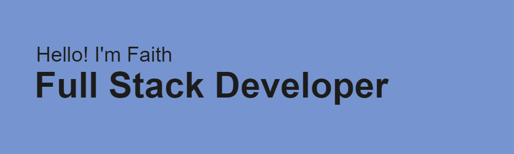

**💻 I've been coding for 4+ years now and love the puzzles that come along with it. I use technology to communicate ideas and create socially-aware solutions. I hope to contribute to more community-driven projects 🫂** 

🛠️ Comfortable working with:
- HTML/CSS and Bootstrap
- Node.js and React.js
- Flask and SQLAlchemy
- C/C++
- Java
- Bash and Vim
- Data Structures

💪 Currently working on:
- Expanding my knowledge of AWS
- Backend improvements to WordSword project
  - Web-based tool to take in documents and condense them without losing meaning
- Frontend improvements to Florida Man Mythos website
  - Digital archive tracing history and implications of sunshine state stereotypes
- Helping some friends revamp the website for their mental health organization

**✉️ You can learn more and connect with me on [LinkedIn](https://www.linkedin.com/in/faithwardtech)**

<!--
**faithward/faithward** is a ✨ _special_ ✨ repository because its `README.md` (this file) appears on your GitHub profile.

Here are some ideas to get you started:

- 🔭 I’m currently working on ...
- 🌱 I’m currently learning ...
- 👯 I’m looking to collaborate on ...
- 🤔 I’m looking for help with ...
- 💬 Ask me about ...
- 📫 How to reach me: ...
- 😄 Pronouns: ...
- ⚡ Fun fact: ...
-->

